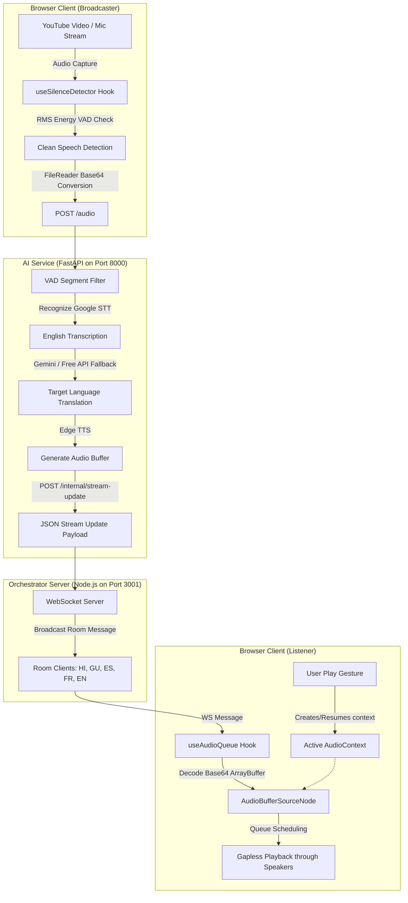

# GlobalMatch AI: Real-Time Multilingual Live Audio Commentary

🔗 **Live Application URL**: [https://a-real-time-multilingual-live-audio.vercel.app/](https://a-real-time-multilingual-live-audio.vercel.app/)

GlobalMatch AI is a real-time, multilingual live audio commentary streaming system designed for live sports broadcasting. The system captures English commentary directly from a live source (such as a shared browser tab running a YouTube stream or a commentator microphone), transcribes the audio, translates it dynamically to multiple target languages in real-time, and streams high-fidelity neural audio commentary back to listeners in their selected language.

---

## 🚀 Key Features

*   **Human-Like Neural Voices**: Integrates Microsoft Edge Neural Text-to-Speech (`edge-tts`) to generate highly expressive, natural voices for all target languages.
*   **Dual-Layer Translation Engine**: Utilizes the Google Gemini API (`gemini-2.5-flash`) for translation, with a seamless, automatic fallback to the free Google Translate API in case of API rate limits or quota issues.
*   **Voice Activity Detection (VAD) Pipeline**: Employs an AnalyserNode-driven client-side VAD and backend `webrtcvad` filters to segment audio and filter out stadium crowd noise, sending only clean speech segments to the speech-to-text (STT) engine.
*   **V8 Stack Overflow Protection**: Uses native asynchronous `FileReader` Blob encoding to transfer audio packets of any length safely without exceeding browser argument limits.
*   **Autoplay Policy Bypass**: Employs an approved Web Audio `AudioContext` gesture-activation pipeline, resolving the common browser autoplay restrictions on dynamic WebSocket audio playback.
*   **WebSocket Orchestration**: Implements a lightweight Node.js WebSocket backend to manage language-specific commentary rooms and broadcast incoming audio packets dynamically to connected listeners.
*   **Vibrant Interactive Dashboard**: Features a Vite + React client dashboard with a live-reacting audio visualizer wave, floating fan emoji reactions, scoreboard stats, and a live transcription/translation feed.

---

## 🗺️ System Architecture

The following diagram illustrates how audio commentary flows through the GlobalMatch AI components in real-time:



---

## 📂 Project Structure

```
├── ai-service/              # Python-based Translation & Neural TTS microservice
│   ├── src/
│   │   ├── main.py          # FastAPI application & /audio endpoint
│   │   ├── translation.py   # Gemini & Free Google Translate fallback services
│   │   ├── tts.py           # Microsoft Edge Neural TTS integration
│   │   ├── broadcaster.py   # Microphone-to-all-rooms CLI broadcaster
│   │   └── vad.py           # VAD logic (webrtcvad) for filtering audio
│   └── .env                 # API Keys, Node URL, and Local Config
│
├── backend/                 # Node.js WebSocket Orchestration Server
│   ├── src/
│   │   └── services/
│   │       └── translationService.js # Extra OpenRouter translation utility
│   ├── server.js            # Express router & WebSocket room broker
│   └── .env                 # Orchestrator Port Configuration
│
├── frontend/                # React Vite Dashboard Client
│   ├── src/
│   │   ├── App.jsx          # React Main UI, Player Console & Feed Views
│   │   ├── index.css        # Rich Premium dark UI styles & animations
│   │   ├── useAudioQueue.js # Web Audio Queue for gapless neural voice playback
│   │   ├── useSilenceDetector.js # AnalyserNode VAD loop for chunking capture audio
│   │   └── useYouTubeDuck.js # YouTube API controller for volume ducking/restoring
│   ├── vite.config.js       # Vite server configurations & proxy rules
│   └── package.json         # Client dependencies & Oxford linter
```

---

## 🛠️ Installation & Setup

### Prerequisites
*   [Node.js](https://nodejs.org/) (v18+)
*   [Python](https://www.python.org/) (v3.9+)

### 1. Node.js Backend Server Setup
1. Navigate to the `backend/` directory:
   ```bash
   cd backend
   ```
2. Install package dependencies:
   ```bash
   npm install
   ```
3. Create a `.env` file in the `backend/` folder:
   ```env
   PORT=3001
   OPENROUTER_API_KEY=your_openrouter_api_key_here
   ```
4. Start the server:
   ```bash
   node server.js
   ```
   The backend will launch on `http://localhost:3001` and accept WebSockets on `ws://localhost:3001`.

---

### 2. Python AI Service Setup
1. Navigate to the `ai-service/` directory:
   ```bash
   cd ai-service
   ```
2. Install the required Python packages:
   ```bash
   pip install fastapi uvicorn httpx python-dotenv edge-tts gTTS SpeechRecognition pyaudio google-genai webrtcvad
   ```
3. Create a `.env` file in the `ai-service/` folder:
   ```env
   GEMINI_API_KEY=your_gemini_api_key_here
   NODE_WS_URL=http://localhost:3001/internal/stream-update
   ```
4. Start the FastAPI microservice:
   ```bash
   python -m uvicorn src.main:app --port 8000
   ```
   The server will run on `http://127.0.0.1:8000`.

---

### 3. Frontend React Setup
1. Navigate to the `frontend/` directory:
   ```bash
   cd frontend
   ```
2. Install dependencies:
   ```bash
   npm install
   ```
3. Start the developer server:
   ```bash
   npm run dev
   ```
4. Open your browser and navigate to [http://localhost:5173/](http://localhost:5173/).

---

## 🎮 How to Watch & Translate a Live Stream

1. Start all three components (Node server, Python AI service, React frontend).
2. Open [http://localhost:5173/](http://localhost:5173/) in your web browser (Chrome or Microsoft Edge are recommended for best tab-audio sharing compatibility).
3. Inside the **Live Audio Stream** panel, **press the Play (▶) button**. 
   * *Note: This is a critical step that initializes and activates the playback audio context under browser autoplay security guidelines.*
4. Paste a public YouTube match video URL into **Watch + Translate** and click **Load video**.
5. Click **Share tab audio**. 
6. In the browser popup, choose the tab playing the YouTube video, and **make sure to tick the "Share tab audio" checkbox** at the bottom-left of the dialog before clicking share.
7. Select the **Source Language** (e.g. English) and the listener's **Language Room** (e.g. Hindi or Spanish).
8. The app will capture the video audio, transcribe/translate it on the fly, and play back the translated neural audio over your speakers while automatically ducking the YouTube volume!

---

## 🧪 Simulation Testing
If you don't have a live match source handy, you can trigger a pre-packaged simulation:
1. Make sure all servers are started and you have clicked **Play** on the frontend player.
2. Trigger the game feed simulator for all language rooms by opening:
   * [http://localhost:8000/simulate](http://localhost:8000/simulate)
3. The server will simulate a live commentary feed with 5-second intervals, translating it and broadcasting it to the clients connected on the web UI in real-time.

---

## 🔧 Core Technical Fixes & Improvements

### 1. Autoplay Block Prevention (`useAudioQueue.js`)
Browsers block any script-initiated audio playback that does not originate from a direct user action (like a button click). In the previous implementation, the playback `AudioContext` was created lazily when a WebSocket message arrived. Because WebSocket events are asynchronous, they are not counted as user gestures, leading to a permanently `suspended` context and no sound.

**Fix**: The play button click handler now invokes the `flush()` callback, which unconditionally forces the creation and activation of the `AudioContext` during the user click:
```javascript
  const flush = useCallback(async () => {
    try {
      getContext(); // Unconditionally create/resume the context on click gesture
    } catch (e) {
      console.warn('[useAudioQueue] Failed to initialize AudioContext on flush:', e);
    }
    const pending = pendingRef.current.splice(0);
    for (const b64 of pending) {
      await enqueue(b64);
    }
  }, [getContext, enqueue]);
```

### 2. V8 Stack Overflow Prevention (`App.jsx`)
To send captured audio to the backend, the audio buffer was converted to base64 using:
`String.fromCharCode(...wavBytes)`
For files larger than 65KB, the spread operator (`...`) pushes more parameters than the maximum call stack limit allowed by Javascript engines, resulting in a silent `RangeError: Maximum call stack size exceeded` that disabled transcription.

**Fix**: Implemented a memory-safe, native asynchronous `FileReader` and `Blob` encoder:
```javascript
      const base64Audio = await new Promise((resolve, reject) => {
        const reader = new FileReader();
        reader.onloadend = () => resolve(reader.result.split(',')[1]);
        reader.onerror = reject;
        reader.readAsDataURL(new Blob([wavBytes]));
      });
```
This is fully compatible with chunked raw audio arrays of any duration and sample rate.

---

## 🎙️ Supported Languages

The system currently supports translation and Neural TTS output for:
*   **English** (`en`) — Neural Voice: `en-US-AriaNeural`
*   **Hindi** (`hi`) — Neural Voice: `hi-IN-SwaraNeural`
*   **Gujarati** (`gu`) — Neural Voice: `gu-IN-DhwaniNeural`
*   **Spanish** (`es`) — Neural Voice: `es-ES-ElviraNeural`
*   **French** (`fr`) — Neural Voice: `fr-FR-DeniseNeural`

---

## 🛡️ License

This project is licensed under the MIT License - see the LICENSE file for details.
